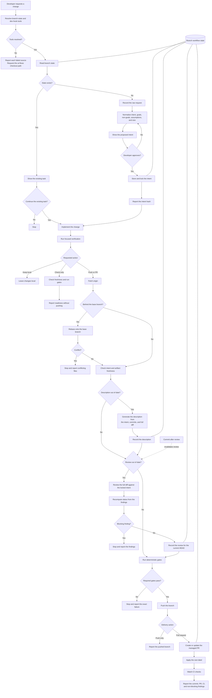
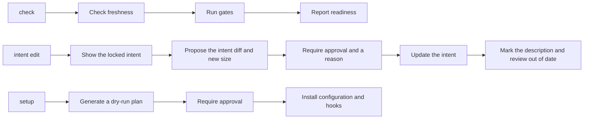

# Development Flow

This diagram summarizes the current `@diego/development` workflow. The executable rules remain authoritative in [WORKFLOW.md](packages/workflows/development/WORKFLOW.md).

## Primary flow

## Supporting actions

## Safety boundaries

- The developer approves the intent before implementation starts.
- Only the branch-state tool writes workflow state.
- A locked intent changes only after explicit approval and a stated reason.
- Deterministic commands decide whether gates pass.
- A blocking review finding stops delivery.
- A required gate failure stops delivery.
- A commit after review makes the review out of date.
- Hooks never rebase a branch.
